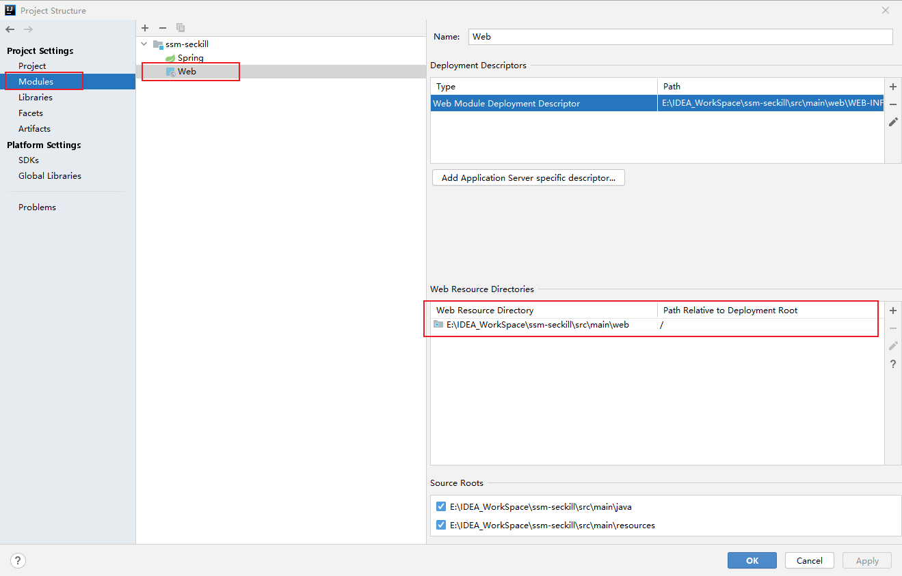

### Spring MVC的配置思路

1. 容器启动的时候会在类路径中查找实现ServletContainerInitializer接口的类。如果找到，就会用这个实现类配置Servlet的容器
2. Spring为我们提供了这个实现类：SpringServletContainerInitializer。
   但是这个Spring并没有用这个类来配置Servlet容器，而是查找WebApplicationInitializer的实现类
   Spring给WebApplicationInitializer也做了一个基础实现类，也就是AbstractAnnotationConfigDispatcherServletInitializer
3. 我们自己定义类SpittrWebAppInitializer就会被查找，用来配置Servlet容器

### Redis缓存配置

设置redis序列化器的时候，注意key和value的类型不一样的时候，要分别设置他俩的序列化器。

### bug解决

##### bug1：

按照Spring实战4.0用纯注解搭建的Spring MVC一直报404的错误。

> 解决：打开Project Structure，在如下位置即可解决

##### bug2

spring-mvc项目配置的jpa与spring-jpa项目的配置一模一样，可spring-mvc项目跑不起来。

> 解决：玄学解决，将Artifact删掉重新配置一遍，重新命一个新名字试试。详情见spring-mvc项目，具体配置都有注释。

##### bug3

spring-mvc项目启动后，浏览器无法访问到index.jsp页面。因为我把webapp删了改成了web，文件夹的标记变没了。

>解决：把web文件夹标记一下，如下图所示
>
>

##### bug4

页面请求进不到Controller，一直报404错误。

> 这个时候一定要去检查项目已经controller的路径。IDEA在当前窗口下，一次只能打开一个项目，而且IDEA是一个项目工程默认一个Tomcat服务器，所以**没必要**在访问路径中加上项目名以示区分不同的项目。eclipse**必须**在访问路径中加上项目名以示区分不同的项目，因为它很有可能一个Tomcat服务器下部署了多个项目，访问路径中不加"项目名"，使用http://localhost:8080/index.jsp，肯定是访问不了，会出现**404访问路径错误**。
>
> 例如http://localhost:8080/（tomcat中配置的路径），就已经可以访问到项目的欢迎页面了。但是为了照顾我们的习惯，在部署的时候，IDEA会帮我们添加上项目名，变成这样http://localhost:8080/seckill/。seckill就相当于我们把我们这个项目（虚拟）部署到tomcat的webapp下的seckill下面了，seckill后面的/就是我们的根路径。在访问`@RequestMapping(value = "/seckill") @RequestMapping(value = "/list", method = RequestMethod.GET)`这个映射的时候需要的路径就是上面那个后面继续加上seckill和list，变成这样http://localhost:8080/seckill/seckill/list

# Mybatis

##### bug1

注解@Transactional配置在测试方法上一直不生效，update等修改语句能够执行成功，但是数据库没有更新。

> 解决：这是因为@Transactional注解在junit环境下默认是回滚的，需要再加一个@Rollback注解，设置为false，这样就会提交到数据库中。