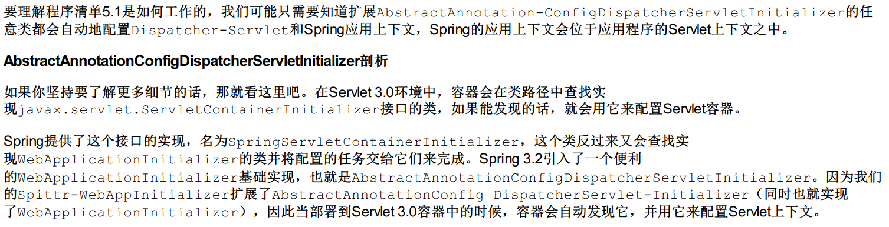
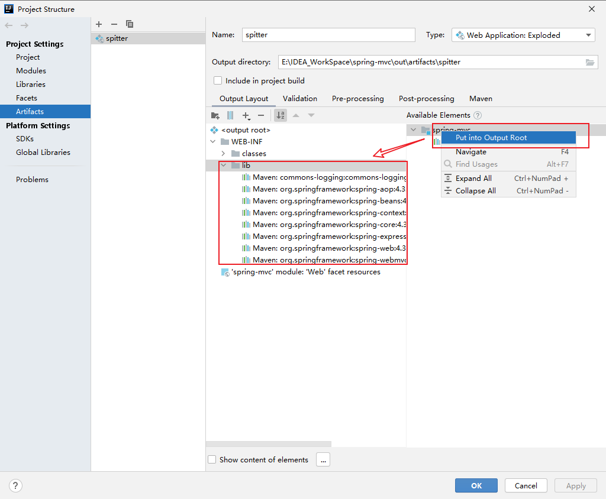

### Spring MVC的配置思路

1. 容器启动的时候会在类路径中查找实现ServletContainerInitializer接口的类。如果找到，就会用这个实现类配置Servlet的容器
2. Spring为我们提供了这个实现类：SpringServletContainerInitializer。
   但是这个Spring并没有用这个类来配置Servlet容器，而是查找WebApplicationInitializer的实现类
   Spring给WebApplicationInitializer也做了一个基础实现类，也就是AbstractAnnotationConfigDispatcherServletInitializer
3. 我们自己定义类SpittrWebAppInitializer就会被查找，用来配置Servlet容器

### Redis缓存配置

设置redis序列化器的时候，注意key和value的类型不一样的时候，要分别设置他俩的序列化器。

### bug解决

##### bug1：

按照Spring实战4.0用纯注解搭建的Spring MVC一直报404的错误。

> 解决：打开Project Structure，在如下位置即可解决

##### bug2

spring-mvc项目配置的jpa与spring-jpa项目的配置一模一样，可spring-mvc项目跑不起来。

> 解决：玄学解决，将Artifact删掉重新配置一遍，重新命一个新名字试试。详情见spring-mvc项目，具体配置都有注释。

# Mybatis

##### bug1

注解@Transactional配置在测试方法上一直不生效，update等修改语句能够执行成功，但是数据库没有更新。

> 解决：这是因为@Transactional注解在junit环境下默认是回滚的，需要再加一个@Rollback注解，设置为false，这样就会提交到数据库中。