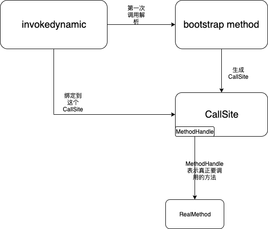

## Java为什么需要lambda表达式？

能够提升代码简洁性、提高代码可读性。

例如，在平时的开发过程中，把一个列表转换成另一个列表或map等等这样的转换操作是一种常见需求。
在没有lambda之前通常都是这样实现的。

```java
List<Long> idList = Arrays.asList(1L, 2L, 3L);
List<Person> personList = new ArrayList<>();
for (long id : idList) {
    personList.add(getById(id));
}
```

代码重复多了之后，大家就会对这种常见代码进行抽象，形成一些类库便于复用。
上面的需求可以抽象成：对一个列表中的每个元素调用一个转换函数转换并输出结果列表。

```java
interface Function {
    <T, R> R fun(T input);
}
<T, R> List<R> map(List<T> inputList, Function function) {
    List<R> mappedList = new ArrayList<>();
    for (T t : inputList) {
        mappedList.add(function.fun(t));
    }
    return mappedList;
}
```

有了这个抽象，最开始的代码便可以”简化”成

```java
List<Long> idList = Arrays.asList(1L, 2L, 3L);
List<Person> personList = map(idList, new Function<Long, Person>() {
    @Override
    public Person fun(Long input) {
        return getById(input);
    }
});
```

虽然实现逻辑少了一些，但是同样也遗憾地发现，代码行数还变多了。
**因为Java语言中函数并不能作为参数传递到方法中**，函数只能寄存在一个类中表示。为了能够把函数作为参数传递到方法中，我们被迫使用了匿名内部类实现，需要加相当多的冗余代码。
在一些支持函数式编程的语言(Functional Programming Language)中（例如Python, Scala, Kotlin等)，函数是一等公民，函数可以成为参数传递以及作为返回值返回。
例如在Kotlin中，上述的代码可以缩减到很短，代码只包含关键内容，没有冗余信息。

```kotlin
val personList = idList.map { id -> getById(id) }
```

这样的编写效率差距也导致了一部分Java用户流失到其他语言，不过最终终于在JDK8也提供了Lambda[表达式](https://so.csdn.net/so/search?q=表达式&spm=1001.2101.3001.7020)能力，来支持这种函数传递。

```java
List<Person> personList = map(idList, input -> getById(input));
```


## Lambda表达式只是匿名内部类的语法糖吗？

如果要在Java语言中实现lambda表达式，初步观察，通过javac把这种箭头语法还原成匿名内部类，就可以轻松实现，因为它们功能基本是等价的（IDEA中经常有提示)。

但是匿名内部类有一些缺点。

1. 每个匿名内部类都会在编译时创建一个对应的class，并且是有文件的，因此在运行时不可避免的会有加载、验证、准备、解析、初始化的类加载过程。
2. 每次调用都会创建一个这个匿名内部类class的实例对象，无论是有状态的(capturing，从上下文中捕获一些变量）还是无状态（non-capturing)的内部类。


## invokedynamic介绍

如果有一种函数引用、指针就好了，但JVM中并没有函数类型表示。
Java中有表示函数引用的对象吗，反射中有个Method对象，但它的问题是性能问题，每次执行都会进行安全检查，且参数都是Object类型，需要boxing等等。

还有其他表示函数引用的方法吗？`MethodHandle`，它是在JDK7中与`invokedynamic`指令等一起提供的新特性。

但直接使用`MethodHandle`来实现，由于没有签名信息，会遇不能重载的问题。并且`MethodHandle`的invoke方法性能不一定能保证比字节码调用好。

### invokedynamic出现的背景

JVM上的动态语言（JRuby, Scala等)，要实现dynamic typing动态类型，是比较麻烦的。
这里简单解释一下什么是dynamic typing，与其相对的是static typing静态类型。
static typing: 所有变量的类型在编译时都是确定的，并且会进行类型检查。
dynamic typing: 变量的类型在编译时不能确定，只能在运行时才能确定、检查。

例如如下动态语言的例子，a和b的类型都是未知的，因此a.append(b)这个方法是什么也是未知的。

```scala
def add(val a, val b)
    a.append(b)
```

而在Java中a和b的类型在编译时就能确定。

```css
SimpleString add(SimpleString a, SimpleString b) {
    return a.append(b);
}
```

编译后的字节码如下，通过`invokevirtual`明确调用变量a的函数签名为`(LSimpleString;)LSimpleString;`的方法。

```assembly
0: aload_1
1: aload_2
2: invokevirtual #2 // Method SimpleString.append:(LSimpleString;)LSimpleString;
5: areturn
```

关于方法调用的字节码指令，JVM中提供了四种。

- invokestatic - 调用静态方法
- invokeinterface - 调用接口方法
- invokevirtual - 调用实例非接口方法的public方法
- invokespecial - 其他的方法调用，private，constructor, super

这几种方法调用指令，在编译的时候就已经明确指定了要调用什么样的方法，且均需要接收一个明确的常量池中的方法的符号引用，并进行类型检查，是不能随便传一个不满足类型要求的对象来调用的，即使传过来的类型中也恰好有一样的方法签名也不行。

### invokedynamic功能

这个限制让JVM上的动态语言实现者感到很艰难，只能暂时通过性能较差的反射等方式实现动态类型。
这说明在字节码层面无法支持动态分派，该怎么办呢，又用到了大家熟悉的”All problems in computer science can be solved by another level of indirection”了。
要实现动态分派，既然不能在编译时决定，那么我们把这个决策推迟到运行时再决定，由用户的自定义代码告诉给JVM要执行什么方法。

在jdk7，Java提供了`invokedynamic`指令来解决这个问题，同时搭配的还有`java.lang.invoke`包。
这个指令大部分用户不太熟悉，因为不像invokestatic等指令，它在Java语言中并没有和它相关的直接概念。

关键的概念有如下几个

1. invokedynamic指令: 运行时JVM第一次到这里的时候会进行linkage，会调用用户指定的bootstrap method来决定要执行什么方法，之后便不需要这个解析步骤。这个`invokedynamic`指令出现的地方也叫做`dynamic call site`
2. Bootstrap Method: 用户可以自己编写的方法，实现自己的逻辑最终返回一个CallSite对象。
3. CallSite: 负责通过getTarget()方法返回MethodHandle
4. MethodHandle: MethodHandle表示的是要执行的方法的指针

再串联起来梳理下

`invokedynamic`在最开始时处于未链接(unlinked)状态，这时这个指令并不知道要调用的目标方法是什么。
当JVM要第一次执行某个地方的`invokedynamic`指令的时候，`invokedynamic`必须先进行链接(linkage)。
链接过程通过调用一个`boostrap method`，传入当前的调用相关信息，`bootstrap method`会返回一个`CallSite`，这个`CallSite`中包含了`MethodHandle`的引用，也就是`CallSite`的target。
`invokedynamic`指令便链接到这个`CallSite`上，并把所有的调用delegate到它当前的target`MethodHandle`上。根据target是否需要变换，`CallSite`可以分为`MutableCallSite`、`ConstantCallSite`和`VolatileCallSite`等，可以通过切换target `MethodHandle`实现动态修改要调用的方法。




## lambda表达式真正是如何实现的

下面直接看一下目前java实现lambda的方式

以下面的代码为例

```java
public class RunnableTest {
    void run() {
        Function<Integer, Integer> function = input -> input + 1;
        function.apply(1);
    }
}
```

编译后通过javap查看生成的字节码

```java
void run();
    descriptor: ()V
    flags:
    Code:
      stack=2, locals=2, args_size=1
         0: invokedynamic #2,  0              // InvokeDynamic #0:apply:()Ljava/util/function/Function;
         5: astore_1
         6: aload_1
         7: iconst_1
         8: invokestatic  #3                  // Method java/lang/Integer.valueOf:(I)Ljava/lang/Integer;
        11: invokeinterface #4,  2            // InterfaceMethod java/util/function/Function.apply:(Ljava/lang/Object;)Ljava/lang/Object;
        16: pop
        17: return
      LineNumberTable:
        line 12: 0
        line 13: 6
        line 14: 17
      LocalVariableTable:
        Start  Length  Slot  Name   Signature
            0      18     0  this   Lcom/github/liuzhengyang/invokedyanmic/RunnableTest;
            6      12     1 function   Ljava/util/function/Function;
      LocalVariableTypeTable:
        Start  Length  Slot  Name   Signature
            6      12     1 function   Ljava/util/function/Function<Ljava/lang/Integer;Ljava/lang/Integer;>;
 
private static java.lang.Integer lambda$run$0(java.lang.Integer);
    descriptor: (Ljava/lang/Integer;)Ljava/lang/Integer;
    flags: ACC_PRIVATE, ACC_STATIC, ACC_SYNTHETIC
    Code:
      stack=2, locals=1, args_size=1
         0: aload_0
         1: invokevirtual #5                  // Method java/lang/Integer.intValue:()I
         4: iconst_1
         5: iadd
         6: invokestatic  #3                  // Method java/lang/Integer.valueOf:(I)Ljava/lang/Integer;
         9: areturn
      LineNumberTable:
        line 12: 0
      LocalVariableTable:
        Start  Length  Slot  Name   Signature
            0      10     0 input   Ljava/lang/Integer;
```

对应`Function<Integer, Integer> function = input -> input + 1;`这一行的字节码为

```assembly
0: invokedynamic #2,  0              // InvokeDynamic #0:apply:()Ljava/util/function/Function;
5: astore_1
```

这里再复习一下`invokedynamic`的步骤。

1. JVM第一次解析时，调用用户定义的`bootstrap method`
2. `bootstrap method`会返回一个`CallSite`
3. `CallSite`中能够得到`MethodHandle`，表示方法指针
4. JVM之后调用这里就不再需要重新解析，直接绑定到这个`CallSite`上，调用对应的target `MethodHandle`，并能够进行inline等调用优化

第一行`invokedynamic`后面有两个参数，第二个0没有意义固定为0 第一个参数是#2，指向的是常量池中类型为[CONSTANT_InvokeDynamic_info](https://docs.oracle.com/javase/specs/jvms/se8/html/jvms-4.html#jvms-4.4.10)的常量。

```assembly
#2 = InvokeDynamic      #0:#32         // #0:apply:()Ljava/util/function/Function;
```

这个常量对应的#0:#32中第二个#32表示的是这个`invokedynamic`指令对应的动态方法的名字和方法签名（方法类型）

```assembly
#32 = NameAndType        #43:#44        // apply:()Ljava/util/function/Function;
```

第一个#0表示的是`bootstrap method`在BootstrapMethods表中的索引。在javap结果的最后看到是

```assembly
BootstrapMethods:
  0: #28 invokestatic java/lang/invoke/LambdaMetafactory.metafactory:(Ljava/lang/invoke/MethodHandles$Lookup;Ljava/lang/String;Ljava/lang/invoke/MethodType;Ljava/lang/invoke/MethodType;Ljava/lang/invoke/MethodHandle;Ljava/lang/invoke/MethodType;)Ljava/lang/invoke/CallSite;
    Method arguments:
      #29 (Ljava/lang/Object;)Ljava/lang/Object;
      #30 invokestatic com/github/liuzhengyang/invokedyanmic/RunnableTest.lambda$run$0:(Ljava/lang/Integer;)Ljava/lang/Integer;
      #31 (Ljava/lang/Integer;)Ljava/lang/Integer;
```

再看下`BootstrapMethods`属性对应[JVM虚拟机规范](https://docs.oracle.com/javase/specs/jvms/se8/html/jvms-4.html#jvms-4.7.23)里的说明。

```assembly
BootstrapMethods_attribute {
    u2 attribute_name_index;
    u4 attribute_length;
    u2 num_bootstrap_methods;
    {   u2 bootstrap_method_ref;
        u2 num_bootstrap_arguments;
        u2 bootstrap_arguments[num_bootstrap_arguments];
    } bootstrap_methods[num_bootstrap_methods];
}
 
bootstrap_method_ref
The value of the bootstrap_method_ref item must be a valid index into the constant_pool table. The constant_pool entry at that index must be a CONSTANT_MethodHandle_info structure
 
bootstrap_arguments[]
Each entry in the bootstrap_arguments array must be a valid index into the constant_pool table. The constant_pool entry at that index must be a CONSTANT_String_info, CONSTANT_Class_info, CONSTANT_Integer_info, CONSTANT_Long_info, CONSTANT_Float_info, CONSTANT_Double_info, CONSTANT_MethodHandle_info, or CONSTANT_MethodType_info structure
 
CONSTANT_MethodHandle_info The CONSTANT_MethodHandle_info structure is used to represent a method handle
```

这个BootstrapMethod属性可以告诉`invokedynamic`指令需要的`boostrap method`的引用以及参数的数量和类型。
\#28对应的是bootstrap_method_ref，为

```assembly
#28 = MethodHandle       #6:#40         // invokestatic java/lang/invoke/LambdaMetafactory.metafactory:(Ljava/lang/invoke/MethodHandles$Lookup;Ljava/lang/String;Ljava/lang/invoke/MethodType;Ljava/lang/invoke/MethodType;Ljava/lang/invoke/MethodHandle;Ljava/lang/invoke/MethodType;)Ljava/lang/invoke/CallSite;
```

按照JVM规范，BootstrapMethod接收3个标准参数和一些自定义参数，标准参数如下

1. `MethodHandles.$Lookup`类型的caller参数，这个对象能够通过类似反射的方式拿到在执行`invokedynamic`指令这个环境下能够调动到的方法，比如其他类的private方法是调用不到的。这个参数由JVM来入栈
2. String类型的invokedName参数，表示`invokedynamic`要实现的方法的名字，在这里是`apply`，是lambda表达式实现的方法名，这个参数由JVM来入栈
3. MethodType类型的invokedType参数，表示`invokedynamic`要实现的方法的类型，在这里是`()Function`，这个参数由JVM来入栈

\#29,#30,#31是可选的自定义参数类型

```assembly
#29 = MethodType         #41            //  (Ljava/lang/Object;)Ljava/lang/Object;
#30 = MethodHandle       #6:#42         // invokestatic com/github/liuzhengyang/invokedyanmic/RunnableTest.lambda$run$0:(Ljava/lang/Integer;)Ljava/lang/Integer;
#31 = MethodType         #21            //  (Ljava/lang/Integer;)Ljava/lang/Integer;
```

通过`java.lang.invoke.LambdaMetafactory#metafactory`的代码说明下

```java
public static CallSite metafactory(MethodHandles.Lookup caller,
        String invokedName,
        MethodType invokedType,
        MethodType samMethodType,
        MethodHandle implMethod,
        MethodType instantiatedMethodType)
```

前面三个介绍过了，剩下几个为

1. MethodType samMethodType: sam(SingleAbstractMethod)就是`#29 = MethodType #41 // (Ljava/lang/Object;)Ljava/lang/Object;`，表示要实现的方法对象的类型，不过它没有泛型信息，(Ljava/lang/Object;)Ljava/lang/Object;
2. MethodHandle implMethod: 真正要执行的方法的位置，这里是`com.github.liuzhengyang.invokedyanmic.Runnable.lambda$run$0(Integer)Integer/invokeStatic`，这里是javac生成的一个对lambda解语法糖之后的方法，后面进行介绍
3. MethodType instantiatedMethodType: 和samMethod基本一样，不过会包含泛型信息，(Ljava/lang/Integer;)Ljava/lang/Integer;

`private static java.lang.Integer lambda$run$0(java.lang.Integer);`这个方法是有javac把lambda表达式desugar解语法糖生成的方法，如果lambda表达式用到了上下文变量，则为有状态的，这个表达式也叫做capturing-lambda，会把变量作为这个生成方法的参数传进来，没有状态则为non-capturing。
另外如果使用的是java8的MethodReference，例如Main::run这种语法则说明有可以直接调用的方法，就不需要再生成一个中间方法。

继续看`5: astore_1`这条指令，表示把当前操作数栈的对象引用保存到index为1的局部变量表中，即赋值给了function变量。说明前面执行完`invokedynamic #2, 0 `后，在操作数栈中插入了一个类型为Function的对象。
这里的过程需要继续看一下`LambdaMetafactory#metafactory`的实现。

```java
public static CallSite metafactory(MethodHandles.Lookup caller,
                                   String invokedName,
                                   MethodType invokedType,
                                   MethodType samMethodType,
                                   MethodHandle implMethod,
                                   MethodType instantiatedMethodType)
    throws LambdaConversionException {
    AbstractValidatingLambdaMetafactory mf;
    mf = new InnerClassLambdaMetafactory(caller, invokedType,
                                         invokedName, samMethodType,
                                         implMethod, instantiatedMethodType,
                                         false, EMPTY_CLASS_ARRAY, EMPTY_MT_ARRAY);
    mf.validateMetafactoryArgs();
    return mf.buildCallSite();
}
```

创建了一个`InnerClassLambdaMetafactory`，然后调用`buildCallSite`返回CallSite

看一下`InnerClassLambdaMetafactory`是做什么的: `Lambda metafactory implementation which dynamically creates an inner-class-like class per lambda callsite.`

怎么回事！饶了一大圈还是创建了一个inner class！先不要慌，先看完，最后分析下和普通inner class的区别。

1. 创建`InnerClassLambdaMetafactory`的过程大概是参数的一些赋值和初始化等

2. 再看`buildCallSite`，这个复杂一些，方法描述说明为：`Build the CallSite. Generate a class file which implements the functional interface, define the class, if there are no parameters create an instance of the class which the CallSite will return, otherwise, generate handles which will call the class' constructor.`

   创建一个实现functional interface的的class文件，define这个class，如果是没有参数non-capturing类型的创建一个类实例，CallSite可以固定返回这个实例，否则有状态，CallSite每次都要通过构造函数来生成新对象。

这里相比普通的InnerClass，有一个内存优化，无状态就使用一个对象。

`buildCallSite`方法实现的第一步是调用spinInnerClass()，通过ASM生成一个function interface的实现类字节码并且进行类加载返回。

```java
private Class<?> spinInnerClass() throws LambdaConversionException {
    // ...
    // 只保留关键代码
    cw.visit(CLASSFILE_VERSION, ACC_SUPER + ACC_FINAL + ACC_SYNTHETIC, lambdaClassName, null, JAVA_LANG_OBJECT, interfaces);
    for (int i = 0; i < argDescs.length; i++) {
        FieldVisitor fv = cw.visitField(ACC_PRIVATE + ACC_FINAL, argNames[i], argDescs[i], null, null);
        fv.visitEnd();
    }
    generateConstructor();
    if (invokedType.parameterCount() != 0) {
        generateFactory();
    }
    // Forward the SAM method
    MethodVisitor mv = cw.visitMethod(ACC_PUBLIC, samMethodName, samMethodType.toMethodDescriptorString(), null, null);
    mv.visitAnnotation("Ljava/lang/invoke/LambdaForm$Hidden;", true);
    new ForwardingMethodGenerator(mv).generate(samMethodType);

    byte[] classBytes = cw.toByteArray();

    return UNSAFE.defineAnonymousClass(targetClass, classBytes, null);
}
```

生成方法为

1. 声明要实现的接口
2. 创建保存构造器参数用的各个字段
3. 生成构造函数，如果有参数，则生成一个static Factory方法
4. 实现function interface里的要实现的方法，forward到implMethodName上，也就是javac生成的方法或者MethodReference指向的方法
5. 生成完毕，通过ClassWrite.toByteArray拿到class字节码数组
6. 通过UNSAFE.defineAnonymousClass(targetClass, classBytes, null) define这个内部类class。这里的defineAnonymousClass比较特殊，它创建出来的匿名类会挂载到targetClass这个宿主类上，然后可以用宿主类的类加载器加载这个类。但是不会但是并不会放到SystemDirectory里，SystemDirectory是类加载器对象+类名字到kclass地址的映射，没有放到这个Directory里，就可以重复加载了，来方便实现一些动态语言的功能，并且能够防止一些内存泄露情况。

这些比较抽象，直观的看一下生成的结果：

```java
public class RunnableTest {
    void run() {
        Function<Integer, Integer> function = input -> input + 1;
        function.apply(1);
    }
}

// $FF: synthetic class
final class RunnableTest$$Lambda$1 implements Function {
    private RunnableTest$$Lambda$1() {
    }
 
    @Hidden
    public Object apply(Object var1) {
        return RunnableTest.lambda$run$0((Integer)var1); // 这个方法是jvm生成的，并且在上面第4步挂上的
    }
}
```

如果有参数的情况呢，例如从外部类中使用了一个非静态字段，并使用了一个外部局部变量

对应的结果为

```java
public class RunnableTest {
    private int a;
    void run() {
        int b = 0;
        Function<Integer, Integer> function = input -> input + 1 + a + b;
        function.apply(1);
    }
}

// 与上面的区别在于第2、3两步
// $FF: synthetic class
final class RunnableTest$$Lambda$1 implements Function {
    private final RunnableTest arg$1; 
    private final int arg$2; // 猜测：这个对应的应该是a，因为b是final的不会变化，没有必要传进来

    private RunnableTest$$Lambda$1(RunnableTest var1, int var2) {
        this.arg$1 = var1;
        this.arg$2 = var2;
    }

    private static Function get$Lambda(RunnableTest var0, int var1) {
        return new RunnableTest$$Lambda$1(var0, var1);
    }

    @Hidden
    public Object apply(Object var1) {
        return this.arg$1.lambda$run$0(this.arg$2, (Integer)var1);
    }
}

```

创建完inner class之后，就是生成需要的CallSite了。 

- 如果没有参数，则生成这个inner class的一个function interface对象示例，创建一个固定返回这个对象的MethodHandle，再包装成ConstantCallSite返回。
- 如果有参数，则返回一个需要每次调用Factory方法产生function interface的对象实例的MethodHandle，包装成ConstantCallSite返回。

这样就完成了bootstrap的过程。invokedynamic链接完之后，后面的调用就直接调用到对应的MethodHandle了，具体是实现就是返回固定的内部类对象，或每次创建新内部类对象。


## 再次对比通过invokedynamic相对于直接匿名内部类语法糖的优势

我们再想一下，Java8实现这一套骚操作的原因是什么。 既然lambda表达式又不需要什么动态分派(调动哪个方法是明确的), 为什么要用invokedynamic呢？
JVM虚拟机的一个基本保证就是低版本的class文件也是能够在高版本的JVM上运行的，并且JVM虚拟机通过版本升级，是在不断优化和提升性能的。

直接转换成内部类实现，固然简单，但编译后的二进制字节码（包括第三方jar包等）内容就固定了，实现固定为创建内部类对象+invoke{virtual, static, special, interface}调用。

未来提升性能只能靠提升创建类对象、invoke指令调用这几个地方的优化。换个熟悉点的说法就是这里写死了。
如果通过invokedynamic呢，javac编译后把足够的信息保留了下来，在JVM执行时能够动态决定如何实现lambda，也就能不断优化lambda表达式的实现，并保持兼容性，给未来留下了更多可能。


## Lambda表达式的一个应用

为了实现字符串是不可变特性，构造字符串的时候，会有拷贝的过程，如果要提升构造字符串的开销，就要避免这样的拷贝。

比如如下是JDK8的String的一个构造函数的实现

```java
public final class String {
    public String(char value[]) {
        this.value = Arrays.copyOf(value, value.length);
    }
}
```

在JDK8中，有一个构造函数是不做拷贝的，但这个方法不是public，需要用一个技巧实现MethodHandles.Lookup & LambdaMetafactory绑定反射来调用，使用的就是上面Lambda表达式的原理。

```java
public final class String {
    String(char[] value, boolean share) {
        // assert share : "unshared not supported";
        this.value = value;
    }
}
```

基于MethodHandles.Lookup & LambdaMetafactory绑定反射的快速构造字符串的方法。代码如下：

```java
public class Main {
    public static void main(String[] args) throws Throwable {
        BiFunction<char[], Boolean, String> func = getStringCreatorJDK8();
        String s = func.apply(new char[]{'a', 'b'}, false);
        System.out.println(s);
    }

    public static BiFunction<char[], Boolean, String> getStringCreatorJDK8() throws Throwable {
        // 反射获得 MethodHandles.Lookup 的 private Lookup(Class<?> lookupClass, int allowedModes) 构造方法
        Constructor<MethodHandles.Lookup> constructor = MethodHandles.Lookup.class.getDeclaredConstructor(Class.class, int.class);
        // 改变构造方法访问权限
        constructor.setAccessible(true);
        // 构造一个Lookup
        MethodHandles.Lookup lookup = constructor.newInstance(
                String.class
                , -1 // Lookup.TRUSTED
        );
        // 派生一个子 Lookup（不太明白为什么要派生一个子 Lookup）
        MethodHandles.Lookup caller = lookup.in(String.class);

        // 通过 Lookup 查找 String 类中返回值为空，参数1为 char，参数2为 boolean 的构造方法
        MethodHandle handle = caller.findConstructor(
                String.class, MethodType.methodType(void.class, char[].class, boolean.class)
        );

        // 绑定 String(char[] value, boolean share) 和 BiFunction 的 apply 方法
        CallSite callSite = LambdaMetafactory.metafactory(
                caller // 具有调用者访问权限的查找上下文，这个对象能够通过类似反射的方式拿到在执行 invokedynamic 指令这个环境下需要调用到的方法，例如这个 String 类 default 权限的构造方法
                , "apply" // 表示 invokedynamic 要实现的方法的名字，在这里是 apply，是 lambda 表达式实现的方法名
                , MethodType.methodType(BiFunction.class) // methodType 的第一个参数为需要实现的接口类型，即 BiFunction；后面的参数表需要捕获的变量类型，这里没有更多的参数。
                , handle.type().generic() // 函数对象要实现的方法的签名和返回类型。这个地方必须使用 generic() 方法，从而使得生成的类能够重写 apply 方法
                , handle // 一个直接方法句柄，描述在调用时应该调用的实现方法
                , handle.type()// 与 samMethodType 参数一样，但返回值必须是 samMethodType 参数返回值的`同`或`子`类型
        );

        // 返回绑定好的 Bi
        return (BiFunction) callSite.getTarget().invokeExact();
    }
}
```

代码逻辑大概分为这么几步：

1. 通过反射拿到 MethodHandles.Lookup 的构造方法
2. 使用该构造方法创建一个用于查找 String 类方法的 Lookup 类
3. 使用 Lookup 类找到 String(char[] value, boolean share) 这个构造方法（以 MethodHandle 的形式）
4. 通过 LambdaMetaFactory.metafactory 方法将生成一个 CallSite 并将 String(char[] value, boolean share) 与 BiFunction 接口的 apply 方法绑定起来
5. 最后取出这个 BiFunction 并返回

